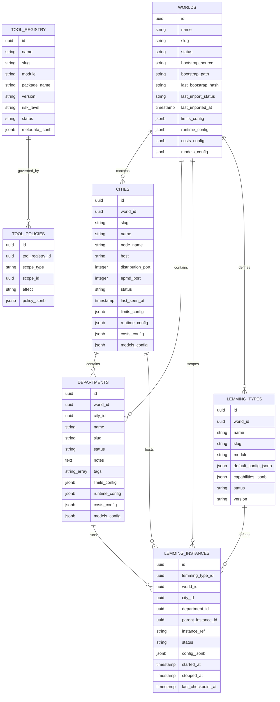
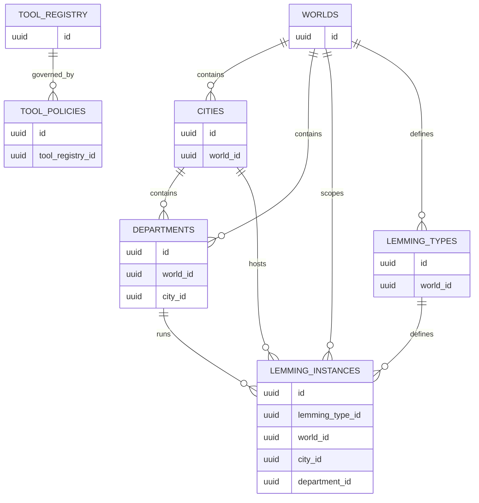

# ADR-0021 — Core Domain Schema

- Status: Accepted (narrowed 2026-03-19)
- Date: 2026-03-14
- Decision Makers: LemmingsOS maintainers

---

# Decision Drivers

1. **Canonical persistence model** — The runtime hierarchy must be represented in the database with a stable, explicit schema. Without a canonical domain model, different subsystems will invent incompatible representations of the same concepts.

2. **Stable identifiers across subsystems** — Routing, persistence, audit logging, authorization, tool governance, and runtime supervision all depend on durable identifiers for Worlds, Cities, Departments, Lemming types, Lemming instances, and Tools.

3. **Hierarchy-aligned architecture** — LemmingsOS is intentionally built around the hierarchy `World → City → Department → Lemming`. The database model must mirror that hierarchy directly so that operational reasoning, control-plane behavior, and runtime state all share the same structure.

4. **Implementation consistency** — Multiple ADRs already reference entities such as `worlds`, `cities`, `departments`, `lemming_types`, `lemming_instances`, and `tool_registry`, but no ADR currently defines them centrally. This creates drift risk across contexts, migrations, and runtime modules.

5. **Foundation for dependent subsystems** — Persistence, audit events, routing, policy evaluation, approval workflows, and runtime observability all need a common domain schema. Without it, downstream implementation remains ambiguous and fragile.

6. **Developer readiness** — The schema definition must be clear enough that a developer can immediately begin implementing Ecto schemas, foreign keys, indexes, and migrations without making architectural guesses.

---

# Context

LemmingsOS operates on a **hierarchical domain model**.

At runtime, the system organizes execution and governance through:

```text
World → City → Department → Lemming
```

Previous ADRs already define key architectural behavior around execution, routing, persistence, tools, authorization, approvals, cost governance, audit events, and runtime topology. However, those ADRs rely on a set of shared domain entities that have not yet been defined in one canonical schema.

Core entities already referenced across the architecture include:

- `worlds`
- `cities`
- `departments`
- `lemming_types`
- `lemming_instances`
- `tool_registry`

These entities are implicitly required by several subsystems, including:

- routing
- persistence
- audit events
- tool execution
- configuration
- runtime supervision
- policy evaluation
- cost governance
- approval workflows

Without a formal domain schema:

- identifiers may drift between subsystems
- relationship ownership becomes ambiguous
- migrations risk encoding inconsistent assumptions
- runtime and control-plane code may model the same concepts differently

This ADR defines the **canonical core domain schema** for LemmingsOS.

---

# Decision

LemmingsOS adopts a canonical relational core domain schema centered on the following persistent entities:

- `worlds`
- `cities`
- `departments`
- `lemming_types`
- `lemming_instances`
- `tool_registry`
- `tool_policies` *(recommended for v1 even if implemented incrementally)*

These entities form the stable foundation for runtime execution, control-plane management, routing, auditability, and policy enforcement.

The schema is intentionally **relational, hierarchy-aware, and identity-first**.

The model distinguishes clearly between:

- **structural entities** — `worlds`, `cities`, `departments`
- **definition entities** — `lemming_types`, `tool_registry`
- **runtime entities** — `lemming_instances`
- **governance entities** — `tool_policies`

This separation is intentional:

- hierarchy structure must remain stable even when runtime instances come and go
- type definitions must exist independently from currently running instances
- policy must be attachable to scope and capability definitions without overloading runtime rows

For `worlds` and `cities`, the schema uses split JSONB columns instead of a
single `config_jsonb` field. This keeps limits, runtime defaults, cost/budget
declarations, and model/provider declarations as separate persisted concerns
at both levels. Both use shared Ecto embedded schema modules for type
consistency.

Department persistence is now shipped. The `departments` table exists with
explicit `world_id` / `city_id` ownership, operator-facing metadata, and split
config buckets using the same embedded-schema pattern as World and City.
Lemming-related persistence (`lemming_types`, `lemming_instances`) remains
deferred and is still described here as the architectural target.

---

# Domain Model Diagram

```text
World
  ├── Cities
  │     └── Departments
  │           └── Lemming Instances
  └── Lemming Types

Tool Registry
  └── Tool Policies
        └── Applied across World / City / Department / Lemming Type scope
```

A second view showing relationships more explicitly:

```text
World
 ├── City
 │    ├── Department
 │    │     ├── Lemming Instance ──────► Lemming Type
 │    │     └── Tool Policy
 │    └── Department
 └── Lemming Types

Tool Registry ──────► Tool Policy
```

---

# Database Schema

The canonical relational structure of the core domain is shown below.



The Mermaid diagram above represents the **canonical relational model** for the runtime domain.

Actual database migrations may include additional operational columns such as:

- `inserted_at`
- `updated_at`
- additional status fields
- operational metadata

However, the entities and relationships defined in the diagram form the **stable domain contract** used by the rest of the system.

For `worlds`, those operational columns are part of the actual persisted
contract for bootstrap linkage and World-scoped declarative configuration.

---

# Entity Responsibilities


## World

The World is the **top-level isolation boundary**.

Responsibilities:

- defines the outermost durable scope
- anchors data partitioning and access boundaries
- scopes Cities and all descendant runtime objects
- provides the minimum required scope tag for system-wide records

A World is not merely a label. It is a foundational identity boundary for persistence, routing, audit events, and authorization.

---

## City

A City is a **runtime node**.

Responsibilities:

- represents an Elixir / OTP node boundary
- owns local runtime execution locality
- contains persisted Departments as control-plane records
- provides placement identity for Lemming instances (not yet persisted)
- supports node-level liveness and operational status

A City is therefore both a domain entity and an operational entity.

### Shipped schema

The `cities` table is now persisted with the following columns:

- `id` (UUID primary key)
- `world_id` (FK to `worlds`)
- `slug`, `name` (human-readable identity)
- `node_name` (full BEAM node identity in `name@host` form; unique per World)
- `host`, `distribution_port`, `epmd_port` (optional connectivity hints)
- `status` (administrative lifecycle: `active`, `disabled`, `draining`)
- `last_seen_at` (heartbeat timestamp; derived liveness is computed from this)
- `limits_config`, `runtime_config`, `costs_config`, `models_config` (split
  JSONB config buckets using shared embedded schemas with World)

Prior wording described a single `config_jsonb` column and a
`last_heartbeat_at` field. The shipped schema uses four split config columns
and `last_seen_at` as the heartbeat timestamp name.

### Runtime identity

`node_name` is the canonical persisted runtime identity. It must be the full
BEAM node name in `name@host` form. It is unique per World and serves as the
upsert key for startup self-registration.

### Status vs liveness

`status` is an administrative lifecycle field set by operators. It does not
reflect runtime health. Derived liveness (`alive`, `stale`, `unknown`) is
computed from `last_seen_at` freshness and is never persisted.

---

## Department

A Department is a **logical grouping of agents** inside a City.

Responsibilities:

- groups runtime executions by purpose or ownership
- acts as a major policy and governance scope
- provides the immediate structural parent for Lemming instances
- simplifies operational navigation and observability

Departments exist to organize and constrain agent execution below the City level.

### Shipped schema

The `departments` table is now persisted with the following columns:

- `id` (UUID primary key)
- `world_id` (FK to `worlds`)
- `city_id` (FK to `cities`)
- `slug`, `name` (human-readable identity)
- `status` (administrative lifecycle: `active`, `disabled`, `draining`)
- `notes` (optional operator-facing metadata)
- `tags` (normalized operator-facing labels)
- `limits_config`, `runtime_config`, `costs_config`, `models_config` (split
  JSONB config buckets storing Department-local overrides only)

The shipped uniqueness contract is city-scoped slug uniqueness via
`departments(city_id, slug)`.

### What remains deferred

Persisted Department identity and configuration now exist, but Department-hosted
runtime execution does not. This ADR still defers:

- Department supervisor / manager runtime processes
- Lemming instance persistence
- capability-driven scheduling inside a Department

---

## Lemming Type

A Lemming Type is an **agent definition scoped to a World**.

Responsibilities:

- defines reusable agent behavior within its World
- identifies the implementation module
- stores default configuration and declared capabilities
- acts as the template from which Lemming instances are created

A Lemming Type is World-scoped. A Type defined in World A cannot be instantiated in World B, preserving the World isolation boundary established in ADR-0003. Two different Worlds may define Types with identical behavior, but they are distinct records with distinct identities.

A Lemming Type is not itself a runtime process.

---

## Lemming Instance

A Lemming Instance is a **running or historical agent execution**.

Responsibilities:

- records a concrete execution lifecycle
- binds a Lemming Type to a specific hierarchy scope
- provides the stable identity used by routing and persistence
- stores runtime status and execution timestamps
- enables auditability and observability of execution history

This is the runtime unit most downstream subsystems operate on.

---

## Tool Registry

The Tool Registry is the **catalog of installed tools**.

Responsibilities:

- records which tools exist in the platform
- stores tool metadata such as module, version, and risk level
- anchors tool discovery, enablement, authorization, and governance
- separates tool definition from specific runtime invocation events

A Tool Registry row defines a capability known to the system, not a specific invocation.

---

# Identity Model

LemmingsOS adopts a durable identity model for the core domain schema.

## Primary Key Expectations

All primary entities should use **UUIDs** as primary keys in v1.

Recommended:

- `Ecto.UUID` for schema identifiers
- generated at the application boundary or database boundary consistently

Rationale:

- UUIDs are stable across distributed nodes
- they avoid coordination issues associated with integer sequences in multi-node thinking
- they are well-supported by Ecto and PostgreSQL
- they work well for public-facing opaque identifiers

## Stable Runtime Identity

For runtime-facing entities, especially `lemming_instances`, stable identity must survive across the runtime lifecycle.

Recommendations:

- database `id` remains the durable primary key
- `instance_ref` may also be stored as a stable opaque logical execution reference
- runtime PIDs or node-local process identifiers must never be treated as canonical durable identity

## Hierarchy References Always Stored

Hierarchy references should be stored explicitly on runtime entities.

For example, `lemming_instances` should always store:

- `world_id`
- `city_id`
- `department_id`
- `lemming_type_id`

Rationale:

- avoids ambiguous joins during audit and observability queries
- makes authorization and scope filtering cheaper and clearer
- reduces accidental mis-scoping in downstream code
- reflects that scope is part of the semantic identity of a runtime instance, not merely a derived property

## Human-Readable Identifiers

In addition to UUID primary keys, entities that appear frequently in the UI or configuration should also have a stable human-readable identifier such as `slug`.

This improves:

- operator ergonomics
- CLI references
- control-plane URLs
- configuration readability

These slugs are supplementary and must not replace UUID primary keys internally.

---

# Runtime Relationships

The core runtime relationships are:

- `cities` belong to `worlds`
- `departments` belong to `cities`
- `departments` also belong to `worlds`
- `lemming_types` belong to `worlds`
- `lemming_instances` belong to `departments`
- `lemming_instances` belong to `cities`
- `lemming_instances` belong to `worlds`
- `lemming_instances` reference `lemming_types`
- `tool_policies` reference `tool_registry`
- `tool_policies` attach to hierarchy scopes and optionally to `lemming_types`

Relationship diagram (Mermaid):



## Relationship Principles

### 1. Downward hierarchy must be explicit

Every descendant entity stores explicit references upward.

### 2. Runtime and definition entities are fully scoped

A `lemming_instance` is never "floating." It must always belong to a World, City, Department, and Lemming Type.

A `lemming_type` is also World-scoped. It must always belong to a World. A Lemming Instance may only reference a Lemming Type within the same World.

### 3. Definitions and executions are separate

A `lemming_type` may exist even if there are no active `lemming_instances`.

### 4. Tools and policy are separate concerns

`tool_registry` describes what a Tool is.
`tool_policies` describe where and how it may be used.

---

# Indexing Strategy

The schema should be indexed according to common runtime, audit, routing, and control-plane query patterns.

## Required or Strongly Recommended Indexes

### Hierarchy indexes

- `cities(world_id)`
- `departments(world_id)`
- `departments(city_id)`
- `lemming_types(world_id)`
- `lemming_instances(world_id)`
- `lemming_instances(city_id)`
- `lemming_instances(department_id)`
- `lemming_instances(lemming_type_id)`

### Runtime state indexes

- `lemming_instances(status)`
- `cities(status)`
- `departments(status)`

### Identity and lookup indexes

- unique index on `worlds.slug`
- unique composite index on `cities(world_id, slug)`
- unique composite index on `departments(city_id, slug)`
- unique composite index on `lemming_types(world_id, slug)`
- unique index on `lemming_instances(instance_ref)`
- unique index on `tool_registry.slug`

### Policy indexes

`tool_policies` uses a polymorphic scope pattern (`scope_type` + `scope_id`)
rather than dedicated FK columns per hierarchy level. Indexes follow accordingly:

- `tool_policies(tool_registry_id)` — look up all policies for a given tool
- `tool_policies(scope_type, scope_id)` — resolve effective policies for a
  given scope (e.g., `scope_type = 'world' AND scope_id = <world_id>`)

A partial index per scope type may be added if query profiling shows it is
beneficial:

```sql
CREATE INDEX ON tool_policies (scope_id) WHERE scope_type = 'world';
CREATE INDEX ON tool_policies (scope_id) WHERE scope_type = 'department';
```

These are optional optimizations, not required at v1 schema definition time.

## Why These Queries Matter

These indexes support the most common expected operations:

- list all Cities in a World
- list all Departments in a City
- list all Lemming instances in a Department
- find active or waiting instances by status
- resolve a runtime instance by `instance_ref`
- filter runtime state by hierarchy scope in the control plane
- resolve effective tool policy for a specific scope or Lemming Type
- support audit/event producers that need fast scope resolution

The indexing strategy is therefore driven by **operational query patterns**, not only by relational purity.

---

# Operational Characteristics

## Supports distributed nodes

The schema is designed to support a multi-City distributed topology.

Why:

- Cities map to runtime nodes
- instance placement must be queryable durably
- operational state such as heartbeat and status must be visible outside the running process tree

## Entities are scoped by World

World scope is first-class across the schema.

Implications:

- every major hierarchy row is world-aware
- filtering by world is cheap and explicit
- access control, routing, and audit systems have a consistent top-level scope

## Designed for runtime observability

The schema supports direct operational inspection.

Examples:

- which City is unhealthy
- which Departments exist under a City
- which instances are waiting, failed, or running
- which Lemming Type a given instance belongs to
- which Tools exist and what risk level they carry

This observability is not accidental. It is part of the schema design.

## Compatible with append-only audit/event model

The domain schema does not replace audit tables, but it gives them stable foreign keys and scope references.

Examples:

- `events.world_id` can align with `worlds.id`
- `events.city_id` can align with `cities.id`
- `events.department_id` can align with `departments.id`
- `events.lemming_id` can align with `lemming_instances.id`

This reduces drift across the event model and the domain model.

---

# Implementation Notes

Shipped Ecto schema modules:

```elixir
LemmingsOs.Worlds.World       # persisted
LemmingsOs.Cities.City        # persisted
LemmingsOs.Departments.Department
```

Planned Ecto schema modules (not yet implemented):

```elixir
LemmingsOs.LemmingTypes.LemmingType
LemmingsOs.LemmingInstances.LemmingInstance
LemmingsOs.ToolRegistry.Tool
LemmingsOs.ToolPolicies.ToolPolicy
```

Prior wording listed module paths under `LemmingsOs.Schema.*`. The shipped
implementation places schemas under their domain context modules (e.g.,
`LemmingsOs.Worlds.World`, `LemmingsOs.Cities.City`,
`LemmingsOs.Departments.Department`), consistent with the project's
context-first module naming convention.

Implementation expectations:

- use standard Ecto schemas
- model hierarchy references with explicit `belongs_to`
- define matching `has_many` relations where useful for navigation
- use `:binary_id` / UUID primary keys consistently
- validate required hierarchy foreign keys at the schema level
- add explicit unique constraints for slugs and runtime identifiers
- use `embeds_one` or JSONB-backed map fields only where the data is genuinely flexible

Recommended design style:

- keep the core hierarchy relational and explicit
- use JSONB only for bounded flexible configuration, not for entity identity or relationship modeling
- align Ecto context boundaries with domain concepts rather than creating one giant persistence context

Example relationship expectations:

- `World has_many :cities`
- `World has_many :lemming_types`
- `City belongs_to :world`
- `City has_many :departments`
- `Department belongs_to :city`
- `Department has_many :lemming_instances`
- `LemmingType belongs_to :world`
- `LemmingInstance belongs_to :lemming_type`
- `ToolPolicy belongs_to :tool_registry`

This ADR does not force a specific context module layout, but it does require that the database model and Ecto schemas follow the canonical structure defined here.

---

# Considered Options

## Option A — Flat entity model

All rows exist in a largely flat structure with minimal explicit hierarchy, relying on conventions or ad hoc metadata to reconstruct scope.

**Rejected.**

Why:

- weakens hierarchy guarantees
- makes authorization and routing harder to reason about
- encourages ambiguous ownership of runtime objects
- does not reflect the architecture’s core World → City → Department model

## Option B — Event-only model

Represent the domain primarily through append-only events and reconstruct current state through projections.

**Rejected for v1.**

Why:

- adds substantial implementation complexity too early
- makes basic control-plane CRUD and runtime queries harder to implement
- is disproportionate to the current self-hosted v1 scope
- the platform already benefits from an event model, but not as the only source of operational truth

## Option C — Document-only storage

Store major entities as JSON documents rather than explicit relational tables.

**Rejected.**

Why:

- weakens foreign key integrity
- makes hierarchical joins and scoped queries less reliable
- increases migration ambiguity
- conflicts with the need for precise indexing, stable references, and predictable relational semantics

## Option D — Relational hierarchy with explicit runtime and definition entities

**Chosen.**

Why:

- matches the architecture directly
- supports stable identifiers and relationships
- makes Ecto implementation straightforward
- works cleanly with audit, routing, and policy systems

---

# Consequences

## Positive

- establishes a stable domain foundation for the whole platform
- creates a clear runtime identity model
- provides a consistent persistence layer across subsystems
- makes routing, audit, policy, and observability implementations materially easier
- reduces schema drift risk between ADRs and implementation
- enables immediate implementation of Ecto schemas and migrations with low ambiguity

## Negative / Trade-offs

- explicit hierarchy references create some denormalization, especially on runtime rows such as `lemming_instances`
- the schema introduces several core tables early, which may feel heavier than a more ad hoc prototype
- JSONB configuration fields require discipline to avoid becoming a dumping ground for undefined behavior

## Mitigations

- treat denormalized scope fields as an intentional operational optimization
- keep the entity set small and focused in v1
- add dedicated tables only when a configuration shape stabilizes beyond what JSONB should hold
- enforce schema discipline through Ecto validations, foreign keys, and unique constraints

---

# Rationale

LemmingsOS already has a strong architectural hierarchy and a growing set of ADRs that depend on shared entities.

Without a canonical domain schema, implementation will drift:

- routing will invent one representation of instance identity
- persistence will invent another
- audit and policy systems will attach to partially overlapping concepts

That is exactly the kind of architectural ambiguity a staff-level ADR set should eliminate.

The chosen schema makes the core model explicit:

- Worlds define isolation
- Cities define runtime nodes
- Departments define logical groupings
- Lemming Types define reusable behavior
- Lemming Instances define concrete execution
- Tool Registry defines platform capabilities
- Tool Policies define durable governance attachments

This is sufficient to begin implementation immediately while leaving room for future specialization.

---

# Implementation Readiness Summary

A developer should be able to begin implementation directly from this ADR by creating:

1. Ecto schemas for the seven core entities
2. migrations with UUID primary keys and explicit foreign keys
3. uniqueness constraints for slugs and runtime identifiers
4. hierarchy and runtime indexes described above
5. context modules that expose CRUD and lookup operations aligned to the hierarchy

This ADR intentionally defines the domain model at the level needed to start those tasks without architectural guesswork.
