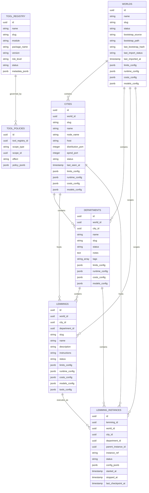

# ADR-0021 — Core Domain Schema

- Status: Accepted
- Date: 2026-03-14
- Decision Makers: LemmingsOS maintainers

---

# 1. Context

LemmingsOS operates on a hierarchical domain model:

```text
World -> City -> Department -> Lemming
```

The product needs a canonical schema that cleanly separates structural entities, agent entities, runtime execution records, and governance entities. Without that split, persistence, routing, audit, authorization, and runtime supervision will each invent incompatible representations of the same concepts.

This ADR defines the intended core domain model of the platform. Implementation may stage individual tables over time, but the architectural contract remains the same: a Lemming is a first-class domain entity, runtime instances are separate from that entity, and any future reusable template layer must be modeled explicitly instead of collapsing the concepts together.

---

# 2. Decision Drivers

1. **Canonical persistence model** - the runtime hierarchy must be represented in the database with a stable, explicit schema.
2. **Stable identifiers across subsystems** - routing, persistence, audit logging, authorization, tool governance, and runtime supervision all depend on durable identifiers.
3. **Hierarchy-aligned architecture** - the database model must mirror the logical hierarchy directly.
4. **Distinct agent and runtime concepts** - a durable Lemming entity must remain distinct from runtime execution records.
5. **Foundation for dependent subsystems** - persistence, audit events, routing, policy evaluation, approval workflows, and runtime observability all need a common domain schema.
6. **Developer readiness** - the schema definition must be clear enough that a developer can implement schemas, keys, indexes, and migrations without guessing.

---

# 3. Decision

LemmingsOS adopts a canonical relational core domain schema centered on the following persistent entities:

- `worlds`
- `cities`
- `departments`
- `lemmings`
- `lemming_instances`
- `tool_registry`
- `tool_policies`

The schema is intentionally relational, hierarchy-aware, and identity-first.

The model distinguishes clearly between:

- **structural entities** - `worlds`, `cities`, `departments`
- **agent entities** - `lemmings`
- **runtime entities** - `lemming_instances`
- **governance entities** - `tool_registry`, `tool_policies`

If the product later introduces a reusable template layer, that layer must be modeled as an explicit extension of the core schema, not as a replacement for `lemmings` or `lemming_instances`.

---

# 4. Domain Model Diagram

```text
World
  ├── Cities
  │     └── Departments
  │           └── Lemmings
  │                 └── Lemming Instances
  └── Tool Registry
        └── Tool Policies
              └── Applied across World / City / Department / Lemming / Instance scope
```

The canonical hierarchy is World -> City -> Department -> Lemming. Runtime execution is represented by Lemming Instances bound to that Lemming entity.

---

# 5. Database Schema



The Mermaid diagram above represents the canonical relational model for the runtime domain.

Actual database migrations may include additional operational columns such as inserted_at, updated_at, and other runtime metadata.

---

# 6. Entity Responsibilities

## World

The World is the top-level isolation boundary.

Responsibilities:

- defines the outermost durable scope
- anchors data partitioning and access boundaries
- scopes Cities and all descendant runtime objects
- provides the minimum required scope tag for system-wide records

## City

A City is a runtime node.

Responsibilities:

- represents an Elixir / OTP node boundary
- owns local runtime execution locality
- contains persisted Departments as structural records
- provides placement identity for Lemmings and runtime instances
- supports node-level liveness and operational status

## Department

A Department is a logical grouping of agents inside a City.

Responsibilities:

- groups agent work by purpose or ownership
- acts as a major policy and governance scope
- provides the immediate structural parent for Lemmings and their runtime instances
- simplifies operational navigation and observability

## Lemming

A Lemming is the durable agent entity scoped to a Department.

Responsibilities:

- defines the agent identity that operators create, inspect, and evolve
- stores reusable metadata and authoring-time configuration
- anchors hierarchy-aware authorization, routing, and lifecycle semantics
- may exist without any current runtime instance

A Lemming is not a runtime execution record, and it is not merely a static template. It is the durable agent entity from which runtime instances are derived.

## Lemming Instance

A Lemming Instance is a running or historical agent execution.

Responsibilities:

- records a concrete execution lifecycle
- binds a Lemming to a specific runtime occurrence
- provides the stable identity used by routing and persistence
- stores runtime status and execution timestamps
- enables auditability and observability of execution history

## Tool Registry

The Tool Registry is the catalog of installed tools.

Responsibilities:

- records which tools exist in the platform
- stores tool metadata such as module, version, and risk level
- anchors tool discovery, enablement, authorization, and governance
- separates tool definition from specific runtime invocation events

---

# 7. Identity Model

LemmingsOS adopts a durable identity model for the core domain schema.

## Primary Key Expectations

All primary entities should use UUIDs as primary keys in v1.

## Stable Runtime Identity

For runtime-facing entities, especially `lemming_instances`, stable identity must survive across the runtime lifecycle.

Recommendations:

- database `id` remains the durable primary key
- `instance_ref` may also be stored as a stable opaque logical execution reference
- runtime PIDs or node-local process identifiers must never be treated as canonical durable identity

## Hierarchy References Always Stored

Hierarchy references should be stored explicitly on runtime entities.

For example, `lemming_instances` should always store:

- `world_id`
- `city_id`
- `department_id`
- `lemming_id`

## Human-Readable Identifiers

In addition to UUID primary keys, entities that appear frequently in the UI or configuration should also have a stable human-readable identifier such as `slug`.

These slugs are supplementary and must not replace UUID primary keys internally.

---

# 8. Runtime Relationships

The core runtime relationships are:

- `cities` belong to `worlds`
- `departments` belong to `cities`
- `departments` also belong to `worlds`
- `lemmings` belong to `departments`
- `lemmings` also belong to `cities` and `worlds`
- `lemming_instances` belong to `lemmings`
- `lemming_instances` belong to `departments`, `cities`, and `worlds`
- `tool_policies` reference `tool_registry`
- `tool_policies` attach to hierarchy scopes and optionally to Lemmings or runtime instances

## Relationship Principles

### 1. Downward hierarchy must be explicit

Every descendant entity stores explicit references upward.

### 2. Runtime and definition entities are distinct

A `lemming` may exist even if there are no active `lemming_instances`.

### 3. Definitions and executions are separate

The durable agent entity and its runtime instances must not be collapsed into one row shape.

### 4. Tools and policy are separate concerns

`tool_registry` describes what a Tool is.
`tool_policies` describe where and how it may be used.

---

# 9. Indexing Strategy

The schema should be indexed according to common runtime, audit, routing, and control-plane query patterns.

## Required or Strongly Recommended Indexes

### Hierarchy indexes

- `cities(world_id)`
- `departments(world_id)`
- `departments(city_id)`
- `lemmings(world_id)`
- `lemmings(city_id)`
- `lemmings(department_id)`
- `lemming_instances(world_id)`
- `lemming_instances(city_id)`
- `lemming_instances(department_id)`
- `lemming_instances(lemming_id)`

### Runtime state indexes

- `lemming_instances(status)`
- `cities(status)`
- `departments(status)`

### Identity and lookup indexes

- unique index on `worlds.slug`
- unique composite index on `cities(world_id, slug)`
- unique composite index on `departments(city_id, slug)`
- unique composite index on `lemmings(department_id, slug)`
- unique index on `lemming_instances(instance_ref)`
- unique index on `tool_registry.slug`

### Policy indexes

`tool_policies` uses a polymorphic scope pattern (`scope_type` + `scope_id`).

- `tool_policies(tool_registry_id)`
- `tool_policies(scope_type, scope_id)`

---

# 10. Operational Characteristics

## Supports distributed nodes

The schema is designed to support a multi-City distributed topology.

## Entities are scoped by World

World scope is first-class across the schema.

## Designed for runtime observability

The schema supports direct operational inspection.

## Compatible with append-only audit/event model

The domain schema does not replace audit tables, but it gives them stable foreign keys and scope references.

---

# 11. Implementation Notes

Intended Ecto schema modules:

```elixir
LemmingsOs.Worlds.World
LemmingsOs.Cities.City
LemmingsOs.Departments.Department
LemmingsOs.Lemmings.Lemming
LemmingsOs.LemmingInstances.LemmingInstance
LemmingsOs.ToolRegistry.Tool
LemmingsOs.ToolPolicies.ToolPolicy
```

If a reusable `lemming_types` layer is introduced later, it should be modeled explicitly and kept separate from both `Lemming` and `LemmingInstance`. This remains an optional extension rather than part of the primary conceptual model.

Implementation sequencing may land the durable Lemming entity before the full runtime instance table, but that sequencing does not change the architectural contract above.

---

# 12. Consequences

## Positive

- establishes a stable domain foundation for the whole platform
- creates a clear distinction between durable agent entities and runtime execution records
- provides a consistent persistence layer across subsystems
- makes routing, audit, policy, and observability implementations materially easier
- reduces schema drift risk between ADRs and implementation
- leaves room for future specialization without collapsing concepts together

## Negative / Trade-offs

- explicit hierarchy references create some denormalization
- the schema introduces several core tables early
- JSONB configuration fields require discipline to avoid becoming a dumping ground for undefined behavior

## Mitigations

- treat denormalized scope fields as an intentional operational optimization
- keep the entity set small and focused in v1
- add dedicated tables only when a configuration or runtime shape stabilizes beyond what the current table should hold
- enforce schema discipline through Ecto validations, foreign keys, and unique constraints

---

# 13. Rationale

LemmingsOS already has a strong architectural hierarchy and a growing set of ADRs that depend on shared entities.

Without a canonical domain schema, implementation will drift:

- routing will invent one representation of agent identity
- persistence will invent another
- audit and policy systems will attach to partially overlapping concepts

That is exactly the kind of architectural ambiguity a staff-level ADR set should eliminate.

The chosen schema makes the core model explicit:

- Worlds define isolation
- Cities define runtime nodes
- Departments define logical groupings
- Lemmings define the durable agent entity
- Lemming Instances define concrete execution
- Tool Registry defines platform capabilities
- Tool Policies define durable governance attachments

This is sufficient to begin implementation immediately while leaving room for future specialization.
