# ADR-0021 — Core Domain Schema

- Status: Accepted
- Date: 2026-03-14
- Decision Makers: LemmingsOS maintainers

---

# 1. Context

LemmingsOS operates on a hierarchical domain model:

```text
World -> City -> Department -> Lemming
```

The product needs a canonical schema that cleanly separates structural entities, agent entities, runtime execution records, and governance entities. Without that split, persistence, routing, audit, authorization, and runtime supervision will each invent incompatible representations of the same concepts.

This ADR defines the intended core domain model of the platform. Implementation may stage individual tables over time, but the architectural contract remains the same: a Lemming is a first-class domain entity, runtime instances are separate from that entity, and any future reusable template layer must be modeled explicitly instead of collapsing the concepts together.

---

# 2. Decision Drivers

1. **Canonical persistence model** - the runtime hierarchy must be represented in the database with a stable, explicit schema.
2. **Stable identifiers across subsystems** - routing, persistence, audit logging, authorization, tool governance, and runtime supervision all depend on durable identifiers.
3. **Hierarchy-aligned architecture** - the database model must mirror the logical hierarchy directly.
4. **Distinct agent and runtime concepts** - a durable Lemming entity must remain distinct from runtime execution records.
5. **Foundation for dependent subsystems** - persistence, audit events, routing, policy evaluation, approval workflows, and runtime observability all need a common domain schema.
6. **Developer readiness** - the schema definition must be clear enough that a developer can implement schemas, keys, indexes, and migrations without guessing.

---

# 3. Decision

LemmingsOS adopts a canonical relational core domain schema centered on the following persistent entities:

- `worlds`
- `cities`
- `departments`
- `lemmings`
- `lemming_instances`
- `lemming_instance_messages`
- `lemming_instance_tool_executions`
- `tool_registry`
- `tool_policies`

The schema is intentionally relational, hierarchy-aware, and identity-first.

The model distinguishes clearly between:

- **structural entities** - `worlds`, `cities`, `departments`
- **agent entities** - `lemmings`
- **runtime entities** - `lemming_instances`
- **runtime transcript entities** - `lemming_instance_messages`
- **runtime tool history entities** - `lemming_instance_tool_executions`
- **governance entities** - `tool_registry`, `tool_policies`

If the product later introduces a reusable template layer, that layer must be modeled as an explicit extension of the core schema, not as a replacement for `lemmings` or `lemming_instances`.

## 3.1 v1 Runtime Schema Contract

This ADR defines the intended core schema. The v1 runtime schema contract is part of the canonical architecture and identifies which runtime tables and fields are required by the v1 implementation.

v1 runtime scope:

- `lemming_instances` records runtime session identity, hierarchy scope, lifecycle status, frozen config snapshot, and temporal markers
- `lemming_instance_messages` stores the durable transcript for each runtime session
- `lemming_instance_tool_executions` stores durable history for attempted tool calls
- the first user request is stored as the first `lemming_instance_messages` row, not duplicated on `lemming_instances`

Deferred beyond v1:

- parent/child instance lineage for delegation workflows
- generalized checkpoint metadata columns on the relational runtime record
- any separate opaque `instance_ref` beyond the UUID primary key, and only if future routing or interop needs justify it

In v1, `lemming_instances.id` is the stable runtime reference.

---

# 4. Domain Model Diagram

```text
World
  ├── Cities
  │     └── Departments
  │           └── Lemmings
  │                 └── Lemming Instances
  └── Tool Registry
        └── Tool Policies
              └── Applied across World / City / Department / Lemming / Instance scope
```

The canonical hierarchy is World -> City -> Department -> Lemming. Runtime execution is represented by Lemming Instances bound to that Lemming entity.

---

# 5. Database Schema

```mermaid
erDiagram

    WORLDS ||--o{ CITIES : contains
    WORLDS ||--o{ DEPARTMENTS : contains
    WORLDS ||--o{ LEMMINGS : scopes
    WORLDS ||--o{ LEMMING_INSTANCES : scopes

    CITIES ||--o{ DEPARTMENTS : contains
    CITIES ||--o{ LEMMINGS : hosts
    CITIES ||--o{ LEMMING_INSTANCES : hosts

    DEPARTMENTS ||--o{ LEMMINGS : contains
    DEPARTMENTS ||--o{ LEMMING_INSTANCES : contains

    LEMMINGS ||--o{ LEMMING_INSTANCES : executes_as
    LEMMING_INSTANCES ||--o{ LEMMING_INSTANCE_MESSAGES : contains
    LEMMING_INSTANCES ||--o{ LEMMING_INSTANCE_TOOL_EXECUTIONS : records

    TOOL_REGISTRY ||--o{ TOOL_POLICIES : governed_by

    WORLDS {
        uuid id
        string name
        string slug
        string status
        string bootstrap_source
        string bootstrap_path
        string last_bootstrap_hash
        string last_import_status
        timestamp last_imported_at
        jsonb limits_config
        jsonb runtime_config
        jsonb costs_config
        jsonb models_config
    }

    CITIES {
        uuid id
        uuid world_id
        string slug
        string name
        string node_name
        string host
        integer distribution_port
        integer epmd_port
        string status
        timestamp last_seen_at
        jsonb limits_config
        jsonb runtime_config
        jsonb costs_config
        jsonb models_config
    }

    DEPARTMENTS {
        uuid id
        uuid world_id
        uuid city_id
        string name
        string slug
        string status
        text notes
        string_array tags
        jsonb limits_config
        jsonb runtime_config
        jsonb costs_config
        jsonb models_config
    }

    LEMMINGS {
        uuid id
        uuid world_id
        uuid city_id
        uuid department_id
        string slug
        string name
        string description
        string instructions
        string status
        jsonb limits_config
        jsonb runtime_config
        jsonb costs_config
        jsonb models_config
        jsonb tools_config
    }

    LEMMING_INSTANCES {
        uuid id
        uuid lemming_id
        uuid world_id
        uuid city_id
        uuid department_id
        string status
        jsonb config_snapshot
        timestamp started_at
        timestamp stopped_at
        timestamp last_activity_at
    }

    LEMMING_INSTANCE_MESSAGES {
        uuid id
        uuid lemming_instance_id
        uuid world_id
        string role
        text content
        string provider
        string model
        integer input_tokens
        integer output_tokens
        integer total_tokens
        jsonb usage
    }

    LEMMING_INSTANCE_TOOL_EXECUTIONS {
        uuid id
        uuid lemming_instance_id
        uuid world_id
        string tool_name
        string status
        jsonb args
        jsonb result
        jsonb error
        text summary
        text preview
        timestamp started_at
        timestamp completed_at
        integer duration_ms
    }

    TOOL_REGISTRY {
        uuid id
        string name
        string slug
        string module
        string package_name
        string version
        string risk_level
        string status
        jsonb metadata_jsonb
    }

    TOOL_POLICIES {
        uuid id
        uuid tool_registry_id
        string scope_type
        uuid scope_id
        string effect
        jsonb policy_jsonb
    }
```



The Mermaid diagram above represents the canonical relational model for the runtime domain.

Operational timestamp columns such as `inserted_at` and `updated_at` are expected additions to runtime tables. They do not change the core schema contract described here.

## 5.1 v1 Runtime Table Contract

The v1 runtime implementation treats the runtime tables below as the required schema contract. This section is normative for v1.

### `lemming_instances`

v1 columns:

- `id` - UUID primary key and stable runtime identity
- `lemming_id` - foreign key to the durable `lemmings` row
- `world_id` - World isolation scope
- `city_id` - City execution locality scope
- `department_id` - Department scheduling scope
- `status` - runtime lifecycle status using the v1 subset from ADR-0004: `created`, `queued`, `processing`, `retrying`, `idle`, `failed`, `expired`
- `config_snapshot` - frozen resolved runtime configuration captured at spawn time
- `started_at` - runtime process birth time
- `last_activity_at` - last meaningful runtime transition
- `stopped_at` - terminal stop time only
- `inserted_at` - durable record creation time
- `updated_at` - last row mutation time

Deferred beyond v1:

- `instance_ref` - not required while the UUID primary key is the stable runtime identity
- `parent_instance_id` - reserved for future delegation and lineage workflows
- `last_checkpoint_at` - deferred until rehydration becomes an active runtime feature

These deferred fields remain valid future extensions, but they are not part of the v1 contract and must not be implied by the schema today.

### `lemming_instance_messages`

v1 columns:

- `id` - UUID primary key
- `lemming_instance_id` - foreign key to the owning runtime session
- `world_id` - World isolation scope for transcript queries
- `role` - transcript role, with v1 values `user` and `assistant`
- `content` - durable transcript content
- `provider` - provider name for assistant messages when applicable
- `model` - model identifier for assistant messages when applicable
- `input_tokens` - normalized input token count when reported
- `output_tokens` - normalized output token count when reported
- `total_tokens` - aggregate token count when a provider reports only a total or when storing the convenience sum is useful
- `usage` - nullable provider-specific usage metadata that does not belong in the normalized columns
- `inserted_at` - transcript insertion time

`lemming_instance_messages` is the single source of truth for runtime transcript content. The first user input is stored as the first `role = "user"` message and is not duplicated on `lemming_instances`.

`total_tokens` and `usage` are intentional compatibility cushions. They allow the schema to preserve useful provider accounting data without forcing every provider to match a prematurely rigid normalized shape. Application logic must remain valid when either field is absent.

In v1, that first user input has a deliberate dual representation:

- durable representation: the first `lemming_instance_messages` row with `role = "user"`
- ephemeral execution representation: the first in-memory work item queued for the executor

This is intentional. The transcript row is the durable record. The work item is
the runtime execution unit. The executor does not consume work directly from the
message table.

### `lemming_instance_tool_executions`

v1 columns:

- `id` - UUID primary key
- `lemming_instance_id` - foreign key to the owning runtime session
- `world_id` - World isolation scope for tool-history queries
- `tool_name` - fixed v1 catalog identifier
- `status` - tool lifecycle status with v1 values `running`, `ok`, and `error`
- `args` - normalized tool arguments as received by the Tool Runtime
- `result` - normalized successful result payload
- `error` - normalized error payload with stable `code`, `message`, and `details`
- `summary` - compact human-readable summary for transcript cards
- `preview` - compact preview text for transcript cards
- `started_at` - tool execution start time
- `completed_at` - tool execution completion or failure time
- `duration_ms` - elapsed wall-clock duration in milliseconds
- `inserted_at` - durable record creation time
- `updated_at` - last row mutation time

`lemming_instance_tool_executions` is runtime history, not a transcript message role. The message table remains limited to user-visible conversation turns, while tool execution rows record external-effect attempts and are merged into session timelines by read models.

Rows are created as `running` before adapter execution and updated to `ok` or `error` after the direct runtime call returns. Rows are also used to reconstruct historical tool cards after page reload.

---

# 6. Entity Responsibilities

## World

The World is the top-level isolation boundary.

Responsibilities:

- defines the outermost durable scope
- anchors data partitioning and access boundaries
- scopes Cities and all descendant runtime objects
- provides the minimum required scope tag for system-wide records

## City

A City is a runtime node.

Responsibilities:

- represents an Elixir / OTP node boundary
- owns local runtime execution locality
- contains persisted Departments as structural records
- provides placement identity for Lemmings and runtime instances
- supports node-level liveness and operational status

## Department

A Department is a logical grouping of agents inside a City.

Responsibilities:

- groups agent work by purpose or ownership
- acts as a major policy and governance scope
- provides the immediate structural parent for Lemmings and their runtime instances
- simplifies operational navigation and observability

## Lemming

A Lemming is the durable agent entity scoped to a Department.

Responsibilities:

- defines the agent identity that operators create, inspect, and evolve
- stores reusable metadata and authoring-time configuration
- anchors hierarchy-aware authorization, routing, and lifecycle semantics
- may exist without any current runtime instance

A Lemming is not a runtime execution record, and it is not merely a static template. It is the durable agent entity from which runtime instances are derived.

## Lemming Instance

A Lemming Instance is a running or historical agent execution.

Responsibilities:

- records a concrete execution lifecycle
- binds a Lemming to a specific runtime occurrence
- provides the stable identity used by routing and persistence
- stores runtime status, temporal markers, and frozen configuration snapshot
- enables auditability and observability of execution history

## Lemming Instance Message

A Lemming Instance Message is a durable transcript record attached to a single runtime session.

Responsibilities:

- stores user-visible conversation turns for a runtime session
- acts as the durable transcript source of truth for runtime interactions
- stores normalized provider/model/token metadata for assistant responses
- allows the first user request to be modeled uniformly with later follow-up turns

## Tool Registry

The Tool Registry is the catalog of installed tools.

Responsibilities:

- records which tools exist in the platform
- stores tool metadata such as module, version, and risk level
- anchors tool discovery, enablement, authorization, and governance
- separates tool definition from specific runtime invocation events

---

# 7. Identity Model

LemmingsOS adopts a durable identity model for the core domain schema.

## Primary Key Expectations

All primary entities should use UUIDs as primary keys in v1.

## Stable Runtime Identity

For runtime-facing entities, especially `lemming_instances`, stable identity must survive across the runtime lifecycle.

Recommendations:

- database `id` remains the durable primary key
- runtime PIDs or node-local process identifiers must never be treated as canonical durable identity

v1 uses the UUID primary key as the stable runtime identity. An additional opaque `instance_ref` is an optional future extension only if routing or interop needs justify it; it is not implied by the current design and is not part of the v1 runtime contract.

## Hierarchy References Always Stored

Hierarchy references should be stored explicitly on runtime entities.

For example, `lemming_instances` should always store:

- `world_id`
- `city_id`
- `department_id`
- `lemming_id`

## Human-Readable Identifiers

In addition to UUID primary keys, entities that appear frequently in the UI or configuration should also have a stable human-readable identifier such as `slug`.

These slugs are supplementary and must not replace UUID primary keys internally.

---

# 8. Runtime Relationships

The core runtime relationships are:

- `cities` belong to `worlds`
- `departments` belong to `cities`
- `departments` also belong to `worlds`
- `lemmings` belong to `departments`
- `lemmings` also belong to `cities` and `worlds`
- `lemming_instances` belong to `lemmings`
- `lemming_instances` belong to `departments`, `cities`, and `worlds`
- `lemming_instance_messages` belong to `lemming_instances`
- `lemming_instance_messages` also belong to `worlds`
- `lemming_instance_tool_executions` belong to `lemming_instances`
- `lemming_instance_tool_executions` also belong to `worlds`
- `tool_policies` reference `tool_registry`
- `tool_policies` attach to hierarchy scopes and optionally to Lemmings or runtime instances

## Relationship Principles

### 1. Downward hierarchy must be explicit

Every descendant entity stores explicit references upward.

### 2. Runtime and definition entities are distinct

A `lemming` may exist even if there are no active `lemming_instances`.

### 3. Definitions and executions are separate

The durable agent entity and its runtime instances must not be collapsed into one row shape.

### 4. Tools and policy are separate concerns

`tool_registry` describes what a Tool is.
`tool_policies` describe where and how it may be used.

---

# 9. Indexing Strategy

The schema should be indexed according to common runtime, audit, routing, and control-plane query patterns.

## Required or Strongly Recommended Indexes

### Hierarchy indexes

- `cities(world_id)`
- `departments(world_id)`
- `departments(city_id)`
- `lemmings(world_id)`
- `lemmings(city_id)`
- `lemmings(department_id)`
- `lemming_instances(world_id)`
- `lemming_instances(city_id)`
- `lemming_instances(department_id)`
- `lemming_instances(lemming_id)`
- `lemming_instance_messages(world_id)`
- `lemming_instance_messages(lemming_instance_id)`
- `lemming_instance_tool_executions(world_id)`
- `lemming_instance_tool_executions(lemming_instance_id)`

### Runtime state indexes

- `lemming_instances(status)`
- `lemming_instance_messages(role)`
- `lemming_instance_tool_executions(status)`
- `lemming_instance_tool_executions(tool_name)`
- `cities(status)`
- `departments(status)`

### Identity and lookup indexes

- unique index on `worlds.slug`
- unique composite index on `cities(world_id, slug)`
- unique composite index on `departments(city_id, slug)`
- unique composite index on `lemmings(department_id, slug)`
- unique index on `tool_registry.slug`

v1 does not require a unique `instance_ref` index because the UUID primary key is the stable runtime identifier. If `instance_ref` is introduced later, it should be treated as an optional extension justified by routing or interop needs, and its uniqueness contract must be defined explicitly at that time.

### Policy indexes

`tool_policies` uses a polymorphic scope pattern (`scope_type` + `scope_id`).

- `tool_policies(tool_registry_id)`
- `tool_policies(scope_type, scope_id)`

---

# 10. Operational Characteristics

## Supports distributed nodes

The schema is designed to support a multi-City distributed topology.

## Entities are scoped by World

World scope is first-class across the schema.

## Designed for runtime observability

The schema supports direct operational inspection.

## Compatible with append-only audit/event model

The domain schema does not replace audit tables, but it gives them stable foreign keys and scope references.

## Runtime Table Semantics for v1

`lemming_instances` temporal markers have explicit semantics:

- `inserted_at` = durable record creation time
- `started_at` = runtime process birth
- `last_activity_at` = last meaningful runtime transition
- `stopped_at` = terminal stop only

There may be a brief `created` window where the durable row already exists but
the executor has not initialized yet. In that window, `inserted_at` is set and
`started_at` remains `nil`.

`lemming_instance_messages` is the canonical transcript table for runtime sessions. The initial user request belongs there, not on the instance row.

`lemming_instance_tool_executions` is the canonical runtime-history table for v1 tool attempts. It is queried alongside messages to render compact transcript tool cards and raw interaction views, but it does not change the `user` / `assistant` transcript role taxonomy.

---

# 11. Implementation Notes

Intended Ecto schema modules:

```elixir
LemmingsOs.Worlds.World
LemmingsOs.Cities.City
LemmingsOs.Departments.Department
LemmingsOs.Lemmings.Lemming
LemmingsOs.LemmingInstances.LemmingInstance
LemmingsOs.LemmingInstances.Message
LemmingsOs.LemmingInstances.ToolExecution
LemmingsOs.ToolRegistry.Tool
LemmingsOs.ToolPolicies.ToolPolicy
```

If a reusable `lemming_types` layer is introduced later, it should be modeled explicitly and kept separate from both `Lemming` and `LemmingInstance`. This remains an optional extension rather than part of the primary conceptual model.

Implementation sequencing may land the durable Lemming entity before the full runtime instance table, but that sequencing does not change the architectural contract above.

---

# 12. Consequences

## Positive

- establishes a stable domain foundation for the whole platform
- creates a clear distinction between durable agent entities and runtime execution records
- provides a consistent persistence layer across subsystems
- makes routing, audit, policy, and observability implementations materially easier
- reduces schema drift risk between ADRs and implementation
- leaves room for future specialization without collapsing concepts together

## Negative / Trade-offs

- explicit hierarchy references create some denormalization
- the schema introduces several core tables early
- JSONB configuration fields require discipline to avoid becoming a dumping ground for undefined behavior

## Mitigations

- treat denormalized scope fields as an intentional operational optimization
- keep the entity set small and focused in v1
- add dedicated tables only when a configuration or runtime shape stabilizes beyond what the current table should hold
- enforce schema discipline through Ecto validations, foreign keys, and unique constraints

---

# 13. Rationale

LemmingsOS already has a strong architectural hierarchy and a growing set of ADRs that depend on shared entities.

Without a canonical domain schema, implementation will drift:

- routing will invent one representation of agent identity
- persistence will invent another
- audit and policy systems will attach to partially overlapping concepts

That is exactly the kind of architectural ambiguity a staff-level ADR set should eliminate.

The chosen schema makes the core model explicit:

- Worlds define isolation
- Cities define runtime nodes
- Departments define logical groupings
- Lemmings define the durable agent entity
- Lemming Instances define concrete execution
- Tool Registry defines platform capabilities
- Tool Policies define durable governance attachments

This is sufficient to begin implementation immediately while leaving room for future specialization.
